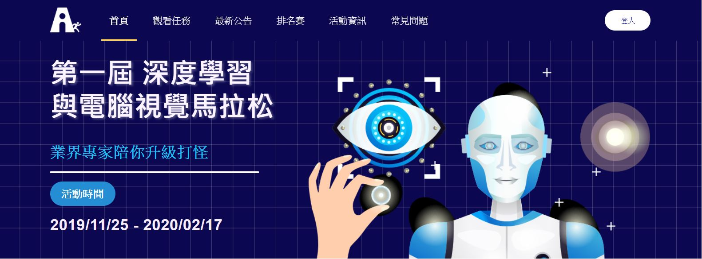

# Deep-Learning-for-Computer-Vision-Marathon

<a href="https://cvdl.cupoy.com/">2019 深度學習與電腦視覺馬拉松 Deep Learning for Computer Vision Marathon</a>

## 1. 基礎影像處理 Image Processing Basics
<a href="https://github.com/tgnco1218/Deep-Learning-for-Computer-Vision-Marathon/tree/master/homework/Day001_Intro_to_OpenCV_and_imshow">001：OpenCV簡介+顯示圖片 Introduction of OpenCV and imshow</a> 
<a href="https://github.com/tgnco1218/Deep-Learning-for-Computer-Vision-Marathon/tree/master/homework/Day002_Color_Presentation_Introduction_RGB_LAB_HSV">002：色彩呈現方式介紹 Introduction of Color Presentation (RGB, LAB, HSV)</a> 
<a href="https://github.com/tgnco1218/Deep-Learning-for-Computer-Vision-Marathon/tree/master/homework/Day003_Image_Preprocessing">003：顏色相關的預處理(改變亮度、色差) Color Preprocessing (adjust brightness, color aberration)</a> 
<a href="https://github.com/tgnco1218/Deep-Learning-for-Computer-Vision-Marathon/tree/master/homework/Day004_Basic_Geometric_Transformation_(Rotation_Scaling_Shifting)">004：矩陣操作基礎的幾何變換(翻轉/縮放/平移) Basic Geometric Transformation (Rotation/Scaling/Shifting)</a> 
<a href="https://github.com/tgnco1218/Deep-Learning-for-Computer-Vision-Marathon/tree/master/homework/Day005_Ploting_and_Displaying_Images_using_OpenCV">005：OpenCV作圖並顯示(長方形/圓形/直線/填色) Ploting and Displaying Images using OpenCV</a> 

<a href="">006：仿射轉換的概念入門與實作 Affine Transformation</a>  
<a href="">007：視角轉換的概念入門與實作 Perspective Transformation</a>  

008：初探邊緣檢測與模糊圖片操作 Filter 操作 (Sobel edge detect, Gaussian Blur)

009：SIFT 介紹與實作 (feature extractor)SIFT: 介紹與實作經典的傳統特徵

010：SIFT 其他應用 (keypoint matching)SIFT 案例分享: 特徵配對

## 2. 電腦視覺深度學習基礎

011：CNN分類器架構-卷積層 Structure of CNN Based Classifier - Convolutional Layers

012：CNN分類器架構-步長、填充 Structure of CNN Based Classifier - Stride and Zero-Padding

013：CNN分類器架構-池化層、全連接層 Structure of CNN Based Classifier - Pooling and Fully-Connected Layers

014：CNN分類器架構-批標準化 Structure of CNN Based Classifier - Batch Normalization

015：訓練一個CNN分類器-Cifar10為例 Training a CNN Based Classifier - Cifar10 as Example

016：Data Augmentation
訓練模型時常常會遇到資料不足的時候，適當的使用Image Augmentation能提升模型的泛化性

017：AlexNet
綜合之前所學的CNN觀念，認識第一個引領影像研究方向朝向深度學習的模型

018：VGG16 and 19
模型繼續進化，認識簡單卻又不差的CNN模型

019：InceptionV1-V3
Inception module提供大家不同於以往的思考方式，將模型的參數量減少，效能卻提升了許多

020：ResNetV1-V2、InceptionV4、Inception-ResNet
首次超越人類分類正確率的模型，Residual module也影響了後來許多的模型架構

021：Transfer learning
學習如何利用前人的知識輔助自己訓練與跨領域學習的方法

022：Breaking Captchas with a CNN

## 3. CNN 應用案例學習

023：Object detection原理
了解Object Detection出現的目的與基本設計原理

024：Object detection基本介紹、演進
了解Object Detection一路發展下來，是如何演進與進步

025：Region Proposal、IOU概念
IOU是貫穿Object Detection的一個重要觀念，了解如何計算IOU對了解Object Detection中許多重要步驟會很有幫助

026：RPN架構介紹
RPN是Faster RCNN成功加速的關鍵，了解RPN便能深入認識Faster RCNN

027：Bounding Box Regression原理
所有的Object Detection模型都需要做Bounding Box的Regression，了解其是如何運作的能幫助我們更認識Object Detection

028：Non-Maximum Suppression (NMS)原理
所有的Object Detection模型都有Non Maximum Suppression的操作，了解其是如何運作的能幫助我們更認識Object Detection

029：程式導讀、實作
了解如何搭建一個SSD模型

030：程式導讀、實作
了解如何搭建一個SSD模型

031：程式導讀、實作
了解如何搭建一個RetinaNet模型

032：YOLO 簡介及算法理解

033：YOLO 細節理解 - 網路輸出的後處理

034：YOLO 細節理解 - 損失函數

035：YOLO 細節理解 - 損失函數程式碼解讀

036：YOLO 細節理解 - 網路架構

037：YOLO 細節理解 - 網路架構程式碼解讀

038：YOLO 演進

039：使用 YOLOv3 偵測圖片及影片中的物件

040：使用 YOLOv3 訓練自己的資料集

041：實作練習 - tiny YOLOv3

## 4. 電腦視覺深度學習實戰

042：understand data

043：define network architecture

044：training

045：load model and inference

046：introduction; mobilenet

047：mobilenetv2

048：tensorflow object detection api (inference)

## 5. 期末專題

049：期末專題 電腦視覺驗收賽

050：期末專題 電腦視覺驗收賽

